# 🏗️ Arquitectura de Código - Eatsy Mobile App

## 📂 Estructura de Directorios

```
src/
├── app/               # Enrutamiento principal (Expo Router)
│   ├── (tabs)/        # Navegación inferior (agrupación lógica)
│   ├── (usuario)/     # Rutas autenticadas (agrupación por rol)
│   └── dish/          # Rutas específicas de gestión de platos
│
├── features/          # Lógica modular por dominio de negocio
│   ├── auth/          # Autenticación y gestión de usuarios
│   ├── dish/          # CRUD de platos, menús y relaciones
│   └── file/          # Subida y gestión de archivos multimedia
│
└── shared/            # Recursos compartidos cross-app
    ├── components/    # Componentes UI reutilizables
    ├── hooks/         # Custom hooks globales
    ├── lib/           # Configuraciones y utilidades
    └── types/         # Tipos TypeScript globales
```

## 🗺️ Diagrama de Flujo Arquitectónico

```mermaid
flowchart TD
    A[Pantallas] -->|Navegación| B(Expo Router)
    B -->|Params| C[Layouts]
    C -->|Render| D[Componentes UI]
    D -->|Interacción| E[Hooks Custom]
    E -->|Manejo de Estado| F[React Query/Zustand]
    F -->|Consumo API| G[Servicios Axios]
    G -->|Validación| H[Zod Schemas]
    H -->|Persistencia| I[(Backend)]
```



## 🧭 Reglas de Estructura

### 1. **Enrutamiento (Expo Router)**

- **Agrupación lógica:** Usar `(folder)` para rutas agrupadas
  ```tsx
  // app/(tabs)/inicio.tsx -> /inicio/
  // app/(usuario)/menu_usuario.tsx -> /usuario/menu/
  ```
- **Layouts compartidos:**
  ```tsx
  // app/(tabs)/_layout.tsx define navegación tipo tabs
  ```

### 2. **Organización por Features**

Cada feature debe contener:

```
features/auth/
├── components/    # Componentes específicos (LoginForm)
├── hooks/         # Lógica reactiva (useAuth)
├── schemas.ts     # Validaciones Zod
└── types.ts       # Tipos TypeScript
```

### 3. **Componentes UI**

- **shared/components/ui:** Componentes genéricos (Button, Input)
- **Nomenclatura:**
  - PascalCase para componentes (`InputUploader`)
  - kebab-case para el nombre de los archivos (`input-uploader.tsx`)

## 📐 Reglas de Desarrollo

### 1. **Gestión de Estado**

- **Estado Local:** `useState`/`useReducer` dentro de componentes
- **Estado Global:**
  - Zustand para datos cross-feature
  - React Query para datos async

### 2. **Estilos**

```tsx
// Usar NativeWind para estilos responsivos
<View className="flex-1 bg-gray-100 dark:bg-gray-900">
  <Text className="text-lg font-bold text-primary-500">¡Bienvenido!</Text>
</View>
```

### 3. **TypeScript**

- Tipos específicos por dominio:
  ```ts
  // features/dish/types.ts
  type Dish = {
    id: string;
    name: string;
    price: number;
    category: "food" | "drink";
  };
  ```

## 🚦 Convenciones de Nomenclatura Estrictas

| Elemento                | Convención                  | Ejemplos Válidos                  | Ejemplos Inválidos                |
| ----------------------- | --------------------------- | --------------------------------- | --------------------------------- |
| **Carpetas**            | kebab-case                  | `feature-flag`, `user-profile`    | `featureFlag`, `UserProfile`      |
| **Archivos**            | kebab-case                  | `dish-service.ts`, `use-store.ts` | `DishService.ts`, `useStore.ts`   |
| **Variables Entorno**   | UPPER_SNAKE_CASE            | `API_BASE_URL`, `AUTH_TOKEN`      | `apiBaseUrl`, `authToken`         |
| **Componentes React**   | PascalCase                  | `UserProfileCard`                 | `DishForm.tsx`, `userProfileCard` |
| **Hooks Custom**        | camelCase con prefijo `use` | `useAuth.ts`, `useScreenResize`   | `UseAuth.ts`, `use-screen-resize` |
| **Funciones/Variables** | camelCase                   | `getUserProfile()`, `isLoading`   | `GetUserProfile()`, `is_loading`  |
| **Tipos/Interfaces**    | PascalCase                  | `DishProps`, `UserProfileType`    | `dish-props`, `userProfileType`   |
| **Clases**              | PascalCase                  | `ApiClient`, `DishAdapter`        | `apiClient`, `dish-adapter`       |

## 📐 Ejemplos de Implementación

### 1. Variables de Entorno (`.env`)

```env
API_BASE_URL=https://api.eatsy.com
MAX_UPLOAD_SIZE=5242880
```

### 2. Componente React

```tsx
// components/ui/input-uploader.tsx
interface UploaderProps {
  maxSize: number;
  onUpload: (file: FileType) => void;
}

export default function InputUploader({ maxSize, onUpload }: UploaderProps) {
  const [isLoading, setIsLoading] = useState(false); // camelCase

  return <View className="upload-container">{/* ... */}</View>;
}
```

### 3. Hook Custom

```typescript
// hooks/use-screen-resize.ts
export function useScreenResize() {
  // camelCase con prefijo 'use'
  const [screenSize, setScreenSize] = useState({ width: 0, height: 0 });

  useEffect(() => {
    const handleResize = () => {
      // camelCase
      setScreenSize(getWindowSize());
    };

    window.addEventListener("resize", handleResize);
    return () => window.removeEventListener("resize", handleResize);
  }, []);

  return screenSize;
}
```

### 4. Servicio con Clase

```typescript
// lib/api/dish-service.ts
class DishAdapter {
  // PascalCase para clases
  private readonly API_ENDPOINT = "/api/v1/dishes"; // UPPER_SNAKE_CASE para constante de clase

  async createDish(newDish: DishCreateType) {
    // camelCase para métodos
    try {
      const response = await apiClient.post(this.API_ENDPOINT, newDish);
      return response.data as DishType; // PascalCase para tipos
    } catch (error) {
      throw new ApiError("CREATE_DISH_FAILED"); // PascalCase para errores
    }
  }
}
```

## 📚 Recursos Clave

1. **Expo Router Docs**:  
   [Enrutamiento avanzado](https://docs.expo.dev/router/advanced/)
2. **React Query Best Practices**:  
   [Optimización de Queries](https://tanstack.com/query/latest/docs/framework/react/overview)

3. **Zod Validation**:  
   [Esquemas compuestos](https://zod.dev/?id=composing-schemas)
