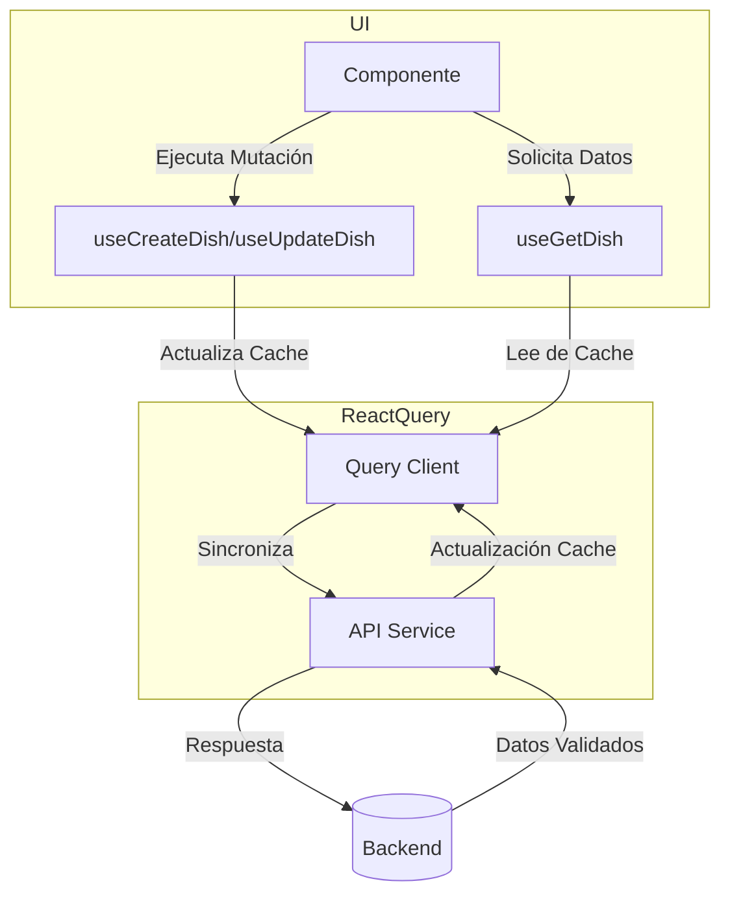

# 🍽️ Dish Hooks Documentation

Colección de hooks para operaciones CRUD de platos usando React Query.  
**Tecnologías principales:** TanStack Query v4, Zod, Expo Router, TypeScript.



---

## 📦 Hooks Disponibles

| Hook              | Descripción               | Método HTTP | Optimistic Updates |
| ----------------- | ------------------------- | ----------- | ------------------ |
| `useCreateDish`   | Crea nuevo plato          | POST        | ✅                 |
| `useGetAllDishes` | Obtiene lista filtrada    | GET         | -                  |
| `useGetDishById`  | Obtiene detalle por ID    | GET         | -                  |
| `useUpdateDish`   | Actualiza plato existente | PUT         | ✅                 |
| `useDeleteDish`   | Elimina plato             | DELETE      | ✅                 |

## 🛠 Uso Básico

### 1. Creación de Plato

```typescript
// components/DishForm.tsx
const { mutate } = useCreateDish();

const handleSubmit = (values: DishCreate) => {
  mutate(values, {
    onSuccess: (newDish) => {
      router.push(`/dishes/${newDish.id}`);
      toast.success("¡Plato creado!");
    },
    onError: (error) => {
      if (error instanceof ApiError) {
        toast.error(error.message);
      }
    },
  });
};
```

### 2. Actualización con Optimistic UI

```typescript
// features/dish/hooks/use-update-dish.ts
onMutate: ({ id, data }) => {
  // 🚀 Actualización optimista
  queryClient.setQueryData(
    DISH_QUERY_KEYS.detail(id),
    (old?: DishResponse) => ({ ...old, ...data })
  );
},
onError: (_, { id }, context) => {
  // 🔄 Rollback en caso de error
  queryClient.setQueryData(DISH_QUERY_KEYS.detail(id), context?.previous);
}
```

## 🛡 Manejo de Errores

Todos los hooks lanzan `ApiError` con metadata estructurada:

```typescript
try {
  await updateDish({ id: "123", data: { price: 15 } });
} catch (error) {
  if (error instanceof ApiError) {
    console.error({
      code: error.code, // Ej: "VALIDATION_ERROR"
      status: error.statusCode, // Ej: 400
      details: error.details, // Ej: { "price": "Debe ser positivo" }
    });
  }
}
```

## ⚡ Optimizaciones Clave

- **Prefetching en Hover:**
  ```typescript
  // En lista de platos
  onMouseEnter={() => queryClient.prefetchQuery({
    queryKey: DISH_QUERY_KEYS.detail(dish.id),
    queryFn: () => getDishById(dish.id)
  })}
  ```
- **Invalidaciones Automáticas:**
  ```typescript
  // Al eliminar un plato
  onSettled: () => {
    queryClient.invalidateQueries({ queryKey: DISH_QUERY_KEYS.lists() });
  };
  ```

## 🧩 Estructura de Query Keys

```typescript
// features/dish/constants.ts
export const DISH_QUERY_KEYS = {
  all: ["dishes"],
  lists: (params?: DishParams) => [...DISH_QUERY_KEYS.all, "list", params],
  details: () => [...DISH_QUERY_KEYS.all, "detail"],
  detail: (id: number) => [...DISH_QUERY_KEYS.details(), id],
};
```

## ✅ Mejores Prácticas

1. **Siempre usar `ApiError`** para manejo consistente de errores.
2. **Combinar `onMutate` + `onError`** para actualizaciones optimistas confiables.
3. **Invalidar queries relacionadas** en `onSettled` para mantener datos frescos.
4. **Usar prefetching** en interacciones previstas (hover, focus).
