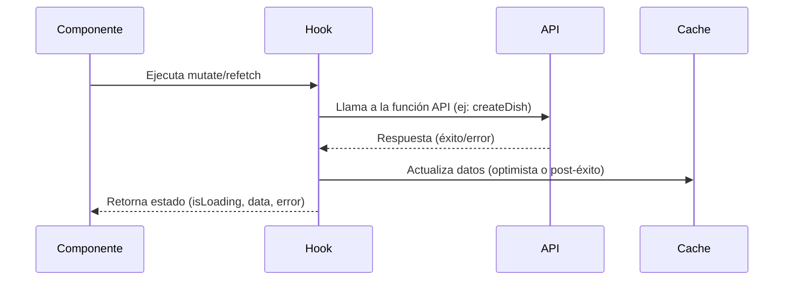
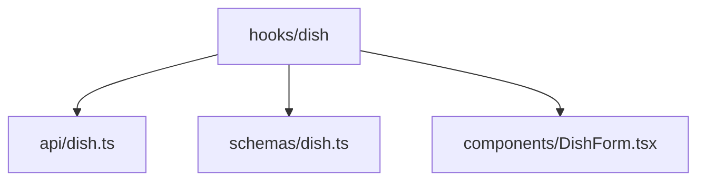

# `hooks/dish` 📌

Carpeta de hooks para la gestión de platos (`Dish`). Contiene hooks especializados para operaciones CRUD, optimizadas para React Query y TypeScript.

## 📁 **Estructura Recomendada**

```bash
hooks/
└── dish/
    ├── use-get-dish.ts
    ├── use-create-dish.ts
    ├── use-update-dish.ts
    ├── use-delete-dish.ts
    └── README.md
```

---

## 🔄 **Flujo de Datos**



---

## 🛠 **Hooks Disponibles**

### 1. `useGetDish`

- **Propósito**: Obtener un plato por ID.
- **Flujo**:
  1. Consulta caché local primero.
  2. Si no hay datos, llama a la API.
  3. Retorna datos validados con Zod.
- **Ejemplo**:
  ```tsx
  const { data: dish, isLoading } = useGetDish(1);
  ```

### 2. `useCreateDish`

- **Propósito**: Crear un nuevo plato.
- **Flujo**:
  1. Actualización optimista de la caché.
  2. Llama a la API.
  3. Si falla, revierte cambios.
- **Ejemplo**:
  ```tsx
  const { mutate } = useCreateDish();
  mutate({ name: "Pasta", price: 12.99 });
  ```

### 3. `useUpdateDish`

- **Propósito**: Actualizar un plato existente.
- **Reglas**:
  - Campos parciales (`Partial<Dish>`).
  - Valida datos con Zod antes de enviar.
- **Ejemplo**:
  ```tsx
  const { mutate } = useUpdateDish();
  mutate({ id: 1, data: { price: 14.99 } });
  ```

### 4. `useDeleteDish`

- **Propósito**: Eliminar un plato.
- **Side Effects**:
  - Invalida la caché de `['dishes']`.
  - Muestra notificación toast.
- **Ejemplo**:
  ```tsx
  const { mutate } = useDeleteDish();
  mutate(1); // ID del plato
  ```

---

## 📜 **Reglas de Uso**

1. **Siempre usar tipos**:
   ```ts
   const { data } = useGetDish(1); // data es de tipo `DishResponse`
   ```
2. **No modificar caché manualmente**: Usar `invalidateQueries` o `setQueryData`.
3. **Composición**: Para lógica compleja, combinar hooks:
   ```ts
   const { data: dish } = useGetDish(1);
   const { mutate } = useUpdateDish();
   ```

---

## ⁉ **FAQ**

### ¿Cómo añadir un nuevo hook?

1. Crea un archivo `use-{acción}-dish.ts`.
2. Implementa siguiendo el patrón existente.
3. Documenta en este README.

---

## 🔗 **Relación con Otros Módulos**


