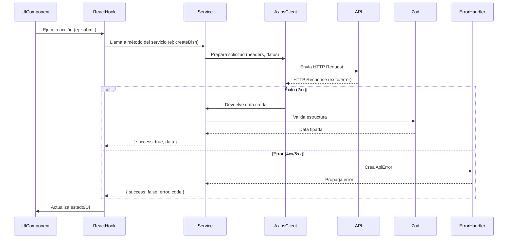

# 🚀 API Client & Service Layer Architecture

Este documento explica el flujo de manejo de solicitudes HTTP, validaciones y errores en la capa de servicios.

## 📂 Estructura de Archivos

```
shared/lib/api/
├── base-service.ts    # Clase base para servicios con validación Zod
├── client.ts          # Cliente Axios configurado con interceptores
├── errors.ts          # Clase ApiError estandarizada
├── schemas.ts         # Esquemas Zod reutilizables
└── types/
    └── api-response.ts  # Tipos para respuestas API
```

## 🔄 Flujo de una Solicitud (Diagrama)



## 🧩 Componentes Clave

### 1. **ApiClient (Axios)**

```typescript
// Interceptor de errores
apiClient.interceptors.response.use(null, (error) => {
  const apiError = new ApiError(error.message, error.response?.status || 500, {
    details: error.response?.data,
  });
  return Promise.reject(apiError);
});
```

- Maneja automáticamente:
  - Autenticación (JWT tokens)
  - Content-Type (JSON/FormData)
  - Normalización de errores

### 2. **BaseService**

```typescript
class BaseService {
  protected validateResponse<T>(data: unknown, schema: z.ZodSchema<T>) {
    try {
      const response = apiResponseSchema.parse(data);
      if (!response.success) throw new ApiError(response.message, 400);
      return { success: true, data: schema.parse(response.data) };
    } catch (error) {
      return this.handleError(error, "Validation failed");
    }
  }
}
```

- Validación centralizada con Zod
- Traducción de errores a formato legible

### 3. **ApiError**

```typescript
throw new ApiError("Invalid image format", 400, { code: "INVALID_FILE_TYPE" });
```

- Propiedades útiles:
  - `statusCode`: HTTP status code
  - `code`: Código de error interno (ej: "INVALID_EMAIL")
  - `details`: Datos técnicos para debugging

## 🛠 Ejemplo de Uso (Upload File)

```typescript
// Hook
const { mutate } = useUploadFile();

// Service
class FileService extends BaseService {
  async uploadImage(fileUri: string) {
    const formData = new FormData();
    // ... lógica de preparación
    const response = await apiClient.post("/upload", formData);
    return this.validateResponse(response.data, imageSchema);
  }
}

// UI
const handleSubmit = async () => {
  try {
    await mutate(file);
  } catch (error) {
    if (error instanceof ApiError) {
      showToast(`${error.code}: ${error.message}`);
    }
  }
};
```

## ✅ Best Practices

1. **Validaciones en Capas**

   - Frontend: Zod schemas
   - Backend: Validación independiente

2. **Manejo de Errores**

```typescript
// En componentes
catch (error) {
  if (error instanceof ApiError) {
    // Mostrar mensaje contextual
  }
}
```

3. **Tipado Estricto**

```typescript
// responses.ts
export type APIResponse<T> =
  | { success: true; data: T }
  | { success: false; error: string; code?: string };
```
