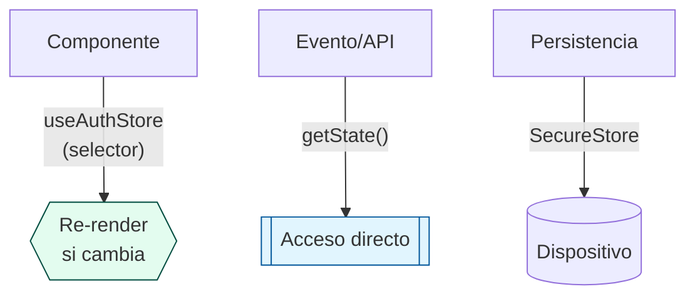
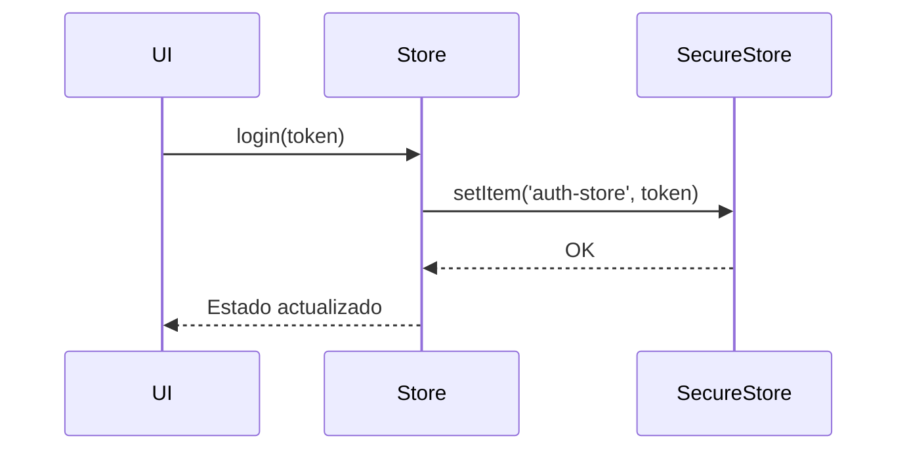

# 📚 Documentación del Auth Store

## 🏗️ Estructura del Store

```typescript
import { create } from "zustand";
import { persist } from "zustand/middleware";
importas SecureStore from "expo-secure-store";

interface AuthState {
  token: string | null;
  isLoading: boolean;
  login: (token: string) => void;
  logout: () => void;
}

export const useAuthStore = create<AuthState>()(
  persist(
    (set) => ({
      token: null,
      isLoading: true,
      login: (token) => set({ token, isLoading: false }),
      logout: () => set({ token: null, isLoading: false }),
    }),
    {
      name: "auth-store",
      storage: {
        getItem: async (name) => {
          const value = await SecureStore.getItemAsync(name);
          return value ? JSON.parse(value) : null;
        },
        setItem: async (name, value) => {
          await SecureStore.setItemAsync(name, JSON.stringify(value));
        },
        removeItem: async (name) => {
          await SecureStore.deleteItemAsync(name);
        },
      },
    }
  )
);
```

## 📊 Diagrama de Flujo (Interacción con el Store)



## 📌 Reglas de Uso

### 1. En Componentes React

```typescript
// ✅ Correcto (re-render controlado)
const token = useAuthStore((state) => state.token);

// ❌ Evitar (re-renders innecesarios)
const { token } = useAuthStore();
```

### 2. En Handlers/Efectos

```typescript
const handleLogin = () => {
  // ✅ Correcto (sin suscripción)
  const { login } = useAuthStore.getState();
  login("nuevo-token");
};
```

### 3. Persistencia Segura



## 🛠 Ejemplos Prácticos

### Proteger una Pantalla

```typescript
function ProtectedScreen() {
  const token = useAuthStore((s) => s.token);

  if (!token) return <Redirect to="/login" />;
  return <UserDashboard />;
}
```

### Interceptor de API

```typescript
api.interceptors.request.use((config) => {
  const { token } = useAuthStore.getState();
  if (token) config.headers.Authorization = `Bearer ${token}`;
  return config;
});
```

### Login (actualiza estado y SecureStore automáticamente):

```typescript
const handleLogin = async () => {
  try {
    const apiToken = await loginAPI(email, password);
    useAuthStore.getState().login(apiToken);
  } catch (error) {
    console.error(error);
  }
```

### Logout (limpia estado y SecureStore):

```typescript
<Button
  onPress={() => useAuthStore.getState().logout()}
  title="Cerrar sesión"
/>
```

### Acceder a múltiples valores con rerender optimizado:

```typescript
import { shallow } from "zustand/shallow";
const { token, isLoading } = useAuthStore(
  (state) => ({ token: state.token, isLoading: state.isLoading }),
  shallow
);
```

### Uso en interceptors API (fuera de componentes):

```typescript
api.interceptors.request.use((config) => {
  const { token } = useAuthStore.getState();
  if (token) config.headers.Authorization = `Bearer ${token}`;
  return config;
});
```
